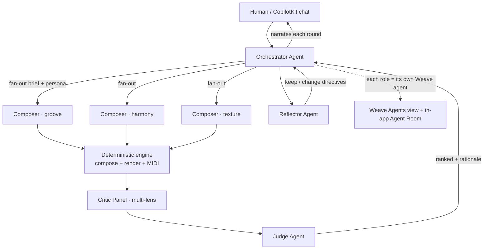

# Multi-Agent Producer Orchestration — Design Spec

**Date:** 2026-06-07
**Status:** Draft for review (v2 — multi-agent backbone; ensemble scope confirmed: full panel)
**Author:** design session (rezn-ai)

## 1. Context & problem

rezn-ai is positioned as a **multi-agent music lab**, but today the LLM usage and the
orchestration don't fully deliver — or *show* — that:

- LLMs appear in **four single-shot roles** (`agents/llm_agents.py`:
  `interpret_brief`, `propose_plan`, `critique`, `reflect_on_feedback`) — one prompt,
  one JSON object, off by default, with deterministic fallbacks. No agent reasons in
  multiple steps, calls tools, or talks to another agent.
- The roles **collapse into a single Weave agent**: `conductor.py` registers one
  `rezn-conductor` (`_AGENT_NAME`) and wraps everything in one session. So the Weave
  Agents view shows *one* actor, not a coordinating team.
- CopilotKit is wired but **nothing drives it**, and the in-app "Activity Feed" is
  not actually live (per the frontend audit) — so even the coordination that exists
  isn't visible to a viewer.

**This spec makes rezn-ai a genuine, demonstrable multi-agent orchestration system.**
Two first-class requirements: (1) **multiple distinct agents that coordinate**, and
(2) **showability** — the coordination must be legible in Weave *and* in the app.

## 2. Goals & non-goals

**Goals**
- **Demonstrably multi-agent:** an Orchestrator, parallel Composer agents, a Critic
  panel, a Judge, and a Reflector — each a *distinct* agent, coordinating per round.
- **Showability (first-class):** each role registers as its own agent in the Weave
  Agents view, and a live in-app **Agent Room** shows who is doing what, in real time.
- **Use LLMs more, in kind:** multi-step reasoning, inter-agent messages, and
  (Phase 2) tool-calling actor–critic loops — not just one-shot nudges.
- **Raise quality:** the ensemble optimizes the existing `technical_score` and honors
  human feedback through the Reflector.
- **Preserve reproducibility:** the multi-agent *topology* is real and visible even
  with deterministic role stand-ins; `REZN_DEEP_MODE` swaps in LLM agents. CI and
  offline demos stay on the deterministic fast path; the golden-render test stays green.

**Non-goals**
- No neural audio model / sample libraries (clean-room boundary unchanged).
- The deterministic composition + synthesis core still writes the notes; agents
  orchestrate, critique, and decide.
- No scoring-rubric rewrite (`eval/scoring.py`) — it is the agents' shared reward.

## 3. The agent ensemble

| Agent | Count | Role | LLM (deep mode) vs deterministic stand-in |
|---|---|---|---|
| **Orchestrator** | 1 | Reads the brief + Reflector directives, allocates strategy slots, runs rounds, narrates | LLM plan vs `harness` allocation |
| **Composer** | N (1 per strategy persona) | Turns the brief + its persona into a candidate plan, then composes via the engine | LLM `propose_plan` per agent vs deterministic nudges |
| **Critic** | 3 (lenses: groove / harmony / mix) | Judges a candidate through one lens, emits score + reasons | LLM `critique` per lens vs heuristic proxies |
| **Judge** | 1 | Aggregates critic verdicts into a ranked decision + rationale | LLM aggregation vs weighted mean of lenses |
| **Reflector** | 1 | Reads the round + human feedback → keep/change directives for next round | LLM `reflect_on_feedback` vs rule-based keep/change |
| **Producer (human)** | 1 | Approves / rejects / requests variants / selects final via CopilotKit | n/a |

Composer personas already exist (`agents/roster.py::COMPOSER_STRATEGIES`):
`groove_architect, harmony_driver, texture_builder, energy_curve, wildcard_mutator`.
Critic lenses are new and map onto existing score features (groove_density,
harmonic_variety, audio_health).

## 4. Showing the multi-agent system (first-class)

This is the part that makes it demonstrable. Two surfaces, one event source.

### 4.1 Weave Agents view — one agent per role
- Replace the single `_AGENT_NAME = "rezn-conductor"` with **per-agent registration**:
  each Composer/Critic/Judge/Reflector/Orchestrator enters its own
  `weave_session(agent_name=…)` + `weave_turn(...)` (`tracing/weave_client.py`
  already supports this).
- Result: the Weave Agents view shows N agents with their own conversations/turns,
  and the trace tree shows orchestrator → parallel composers → parallel critics →
  judge → reflector. This is the "show the judges" artifact.

### 4.2 In-app Agent Room (CopilotKit / Control Room)
- Consume the existing-but-unused `GET /api/batches/{id}/events` stream (poll or SSE)
  to drive a live **Agent Room** panel: one lane per agent, status (thinking /
  done), its latest message, and edges showing hand-offs. This also fixes the
  "activity feed isn't live" gap.
- Reuse the existing `events` / `agentActions` state scaffolding in
  `app/control-room/ControlRoom.tsx`.

### 4.3 Event contract
- Agent identity rides in the **event payload**, not new top-level `BatchEvent` fields
  (so no store/serialization/`api-types.ts` migration). Every agent-tagged event carries
  `payload.agent_id`, `payload.role`, and `payload.phase` (`batch`/`refine`/…) + a short
  human message. The orchestrator/critics/judge emit dedicated `agent.step` events; the
  composers are tagged on the existing `candidate.generated` event (the Agent Room groups
  on `payload.agent_id` regardless of event type).
- **Weave alignment is via per-agent sessions, not event fields.** Each agent runs inside
  `weave_session(agent_name=…)` (see `conductor._agent_scope`), so the Agents view lines up
  without a `weave_op`/`weave_call_id` on every event. Per-candidate traces already ride on
  the candidate's own `weave_call_id` → `trace_url`. (Phase 1 intentionally omits the
  earlier-sketched `weave_op` event field — it had no consumer.)

## 5. Key design decisions

### 5.1 `REZN_DEEP_MODE` flag
- Default **off** → deterministic role stand-ins run, but the ensemble topology and
  all per-agent traces/Agent-Room lanes still render (showable without LLM cost).
- `=1` → each role becomes an LLM agent. Requires `inference_enabled()`; if on
  without a key, fail loud at startup (mirror `inference_required()`).

### 5.2 Where agents run
- The ensemble runs **server-side** in the conductor/engine path so all agents share
  one Weave trace tree and live next to Redis. CopilotKit chat (Phase 3) commands the
  ensemble via a single action; it does not host the agents.

### 5.3 Coordination protocol
- Agents exchange **structured messages** (typed dataclasses), not free text:
  Orchestrator→Composer (brief + persona + directives), Composer→engine (params),
  Critic→Judge (lens score + reasons), Judge→Orchestrator (ranking + rationale),
  Reflector→Orchestrator (keep/change). Each message is logged as a Weave op input.

### 5.4 Rounds & termination
- A "round" = fan-out → compose → critique → judge → reflect. The Orchestrator runs
  1 round on `start_batch`, additional rounds on `refine_batch` (or autonomously in
  Phase 2 until target/plateau/budget).

### 5.5 Failure handling
- Per-agent failures degrade to that role's deterministic stand-in and record
  `source="fallback:<reason>"` (existing `llm_agents.py` contract). Business mutations
  never 500 on a tracing/agent failure (`_SafeTurnScope`, `conductor.py:68-86`).

## 6. Components

**New (backend)**
- `src/rezn_ai/agents/ensemble.py` — Orchestrator loop coordinating the agents; runs
  rounds; emits per-agent events; `@weave_op` per step with per-agent sessions.
- `src/rezn_ai/agents/critic_panel.py` — multi-lens critics + Judge aggregation
  (LLM in deep mode, heuristic proxies otherwise).
- `src/rezn_ai/agents/messages.py` — typed inter-agent message dataclasses.
- `src/rezn_ai/eval/counterfactual.py` — OFF/ON (deterministic vs ensemble) eval
  logged to Weave (fills the audit's missing paired-counterfactual gap).

**Changed (backend)**
- `src/rezn_ai/conductor.py` — call the ensemble; per-agent Weave sessions instead of
  one `rezn-conductor`; enrich events with `agent_id` / `weave_call_id`.
- `src/rezn_ai/agents/llm_agents.py` — give each Composer persona + each Critic lens
  its own system prompt; expose per-agent ops.
- `src/rezn_ai/agents/roster.py` — register the full ensemble so `/api/doctor`
  reports it and the Agents view/Agent Room can enumerate agents.
- `src/rezn_ai/api/main.py` — ensure `GET /api/batches/{id}/events` is stream-friendly
  (poll/SSE); extend `/api/doctor` with `deep_mode` + agent roster.
- `src/rezn_ai/config.py` — `deep_mode()` + startup validation.

**New / changed (frontend)**
- `app/control-room/components/AgentRoom.tsx` — live per-agent lanes + hand-off graph
  driven by the events stream.
- `app/control-room/ControlRoom.tsx` — consume `GET /events` live; render Agent Room.
- (Phase 3) CopilotKit chat surface using `@copilotkit/react-ui` (only its CSS is
  imported today) + a `commandEnsemble` action.
- Implementation note: consult current CopilotKit + Next 16 docs (Context7 / official)
  before writing — the local AGENTS.md warns this Next version has breaking changes.

## 7. Phased plan

### Phase 1 — Multi-agent ensemble + visible coordination *(the core "show it")*
- Stand up Orchestrator + N Composer agents + Critic panel + Judge + Reflector as
  distinct roles with **per-agent Weave registration**.
- Build the in-app **Agent Room** driven by the live events stream.
- Works with deep mode **off** (deterministic stand-ins) so it's demoable + reproducible.
- **Verify:** one brief produces a Weave Agents view with ≥5 agents and a live Agent
  Room showing fan-out → critique → judge → reflect; golden-render test still green.

### Phase 2 — Deliberation depth + autonomy
- Multi-round debate (critics challenge, Judge reconciles); tool-calling actor–critic
  loop where the Orchestrator iterates toward a `technical_score` target under budgets.
- **Verify:** `eval/counterfactual.py` shows ensemble (deep mode on) ≥ deterministic
  baseline on the fixed brief set, logged to Weave.

### Phase 3 — Conversational command + specialists
- CopilotKit chat agent that commands the ensemble (`commandEnsemble`); add
  `arranger` / `mix_engineer` specialist agents and optional `research_genre` tool.
- **Verify:** a human runs a full generate→curate→refine→select loop from chat while
  the Agent Room shows the team working.

### Cross-cutting guardrails
- Per-round call/latency/token budgets; `REZN_DEEP_MODE` default-off; every agent
  step a `@weave.op`; golden-render test green.

## 8. Testing strategy
- **Unit:** message dispatch + each agent's deterministic stand-in; Judge aggregation;
  deep-mode-off equals current behavior.
- **Hermetic ensemble test:** stubbed LLM client returning scripted messages; assert
  the round runs orchestrator→composers→critics→judge→reflector and emits one event
  per agent (no network, matching `conftest.py`).
- **Showability test:** a batch emits events carrying every expected `agent_id`.
- **Counterfactual eval:** OFF vs ON top-score delta.
- **Regression:** full suite + golden render green with deep mode off.

## 9. Observability & success metrics
- Weave: ≥5 distinct agents with their own sessions/turns per batch; nested trace tree.
- In-app: Agent Room renders live lanes + hand-offs from the events stream.
- Quality: ensemble ≥ deterministic baseline on the counterfactual eval (Phase 2).
- Demo success: a viewer can watch the agents coordinate in both Weave and the app.

## 10. Risks & mitigations
- **Tool-calling / structured output on `gpt-oss-120b`** (W&B Inference): verify in a
  Phase 2 spike; OpenAI fallback `gpt-4o-mini` is known-good.
- **Latency with many agents:** run composers/critics concurrently; budgets bound it;
  deep mode off for fast demos.
- **Trace noise:** per-agent sessions are scoped per batch lineage (reuse
  `_conversation_id`) to keep the Agents view clean.

## 11. Decisions to confirm before planning
1. **Ensemble size to show:** ✅ **Confirmed — full panel:** Orchestrator (1) +
   Composers (N running per batch, from 5 personas) + 3-lens Critic panel
   (groove / harmony / mix) + Judge (1) + Reflector (1) → ~10 agents + the human
   producer per batch.
2. **Showcase surface priority:** Weave Agents view first, or the in-app Agent Room
   first (both land in Phase 1, but which is the demo centerpiece)?
3. **Phase 2 reward:** pure `technical_score` vs blended `preference_score`.
4. **Phase 3 `research_genre`:** real web access vs offline curated vs skip.
